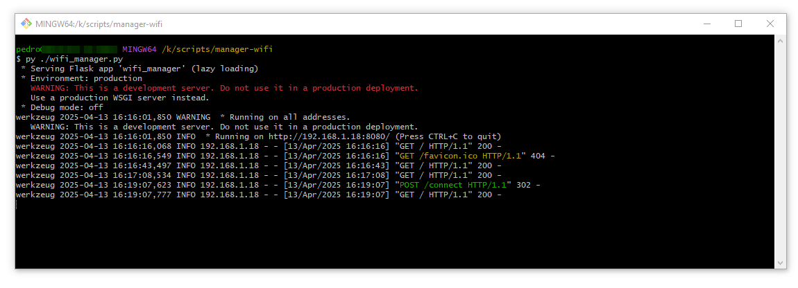

# wifi-manager

Esta solução é uma aplicação em Python que exibe uma interface gráfica para listar e conectar a redes Wifi próximas.

# Instalação 

Instalar Python 3.10

# Pré-requisitos

Na pasta do projeto, execute `pip install -r requirements.txt`

# Executando Aplicação

# Acessando a aplicação

Abra o navegador e acesse `http://localhost:8080` ou `http://192.168.1.18:8080` (Altere para o IP local do seu SO)
